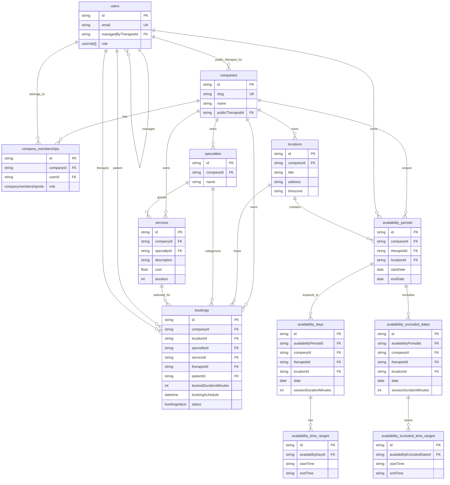

# Database Schema

This document reflects the current Prisma schema in [prisma](../prisma).

## Overview

The schema is organized around four areas:

- tenant and identity
- locations and catalog
- dated availability
- bookings

## Tables

### `companies`

Tenant root record for public profile and company-scoped data.

### `company_memberships`

Join table between `companies` and `users`, with the company-specific role.

### `users`

Application users for therapist, admin, front desk, and patient identities.

### `locations`

Company-owned offices with address and timezone data.

### `specialties`

Company-owned service categories.

### `services`

Bookable offerings under a specialty, with cost and duration.

### `availability_periods`

Dated availability blocks for one therapist at one location.

### `availability_days`

Concrete bookable days derived from an availability period.

### `availability_time_ranges`

One or more active time windows for a single availability day.

### `availability_excluded_dates`

Dates intentionally excluded from a period while preserving restoration metadata.

### `availability_excluded_time_ranges`

Time windows stored for an excluded date.

### `bookings`

Appointments linking company, location, optional therapist/patient/service/specialty, and the scheduled datetime.

## Relationship Summary

- one `company` has many `locations`, `specialties`, `services`, `bookings`, and availability records
- one `company` has many `company_memberships`
- one `user` has many `company_memberships`
- one `specialty` has many `services`
- one `booking` belongs to one `company` and one `location`
- one `booking` may reference one `therapist`, one `patient`, one `specialty`, and one `service`
- one `availability_period` belongs to one `company`, one `therapist`, and one `location`
- one `availability_period` has many `availability_days`
- one `availability_period` has many `availability_excluded_dates`
- one `availability_day` has many `availability_time_ranges`
- one `availability_excluded_date` has many `availability_excluded_time_ranges`

## ER Diagram



## Relationship Tree

```text
companies
├── company_memberships
│   └── users
├── locations
│   ├── bookings
│   │   ├── users (patient)
│   │   ├── users (therapist)
│   │   ├── specialties
│   │   └── services
│   ├── availability_periods
│   │   ├── users (therapist)
│   │   ├── availability_days
│   │   │   └── availability_time_ranges
│   │   └── availability_excluded_dates
│   │       └── availability_excluded_time_ranges
│   ├── availability_days
│   │   ├── users (therapist)
│   │   └── availability_time_ranges
│   └── availability_excluded_dates
│       ├── users (therapist)
│       └── availability_excluded_time_ranges
├── specialties
│   ├── services
│   └── bookings
├── services
│   └── bookings
├── bookings
│   ├── users (patient)
│   ├── users (therapist)
│   ├── locations
│   ├── specialties
│   └── services
├── availability_periods
│   ├── users (therapist)
│   ├── locations
│   ├── availability_days
│   │   └── availability_time_ranges
│   └── availability_excluded_dates
│       └── availability_excluded_time_ranges
├── availability_days
│   ├── users (therapist)
│   ├── locations
│   └── availability_time_ranges
└── availability_excluded_dates
    ├── users (therapist)
    ├── locations
    └── availability_excluded_time_ranges

users
├── company_memberships
├── companies (publicTherapist)
├── users (managedPersonnel / managedByTherapist)
├── bookings (patient)
├── bookings (therapist)
├── availability_periods
├── availability_days
└── availability_excluded_dates

specialties
├── services
└── bookings

services
└── bookings
```

## Notes

- Dated availability is the scheduling source of truth for booking.
- Availability is keyed by therapist, location, and date; it is not service-specific.
- `bookedDurationMinutes` stores the effective reserved slot length used when the booking was created.
