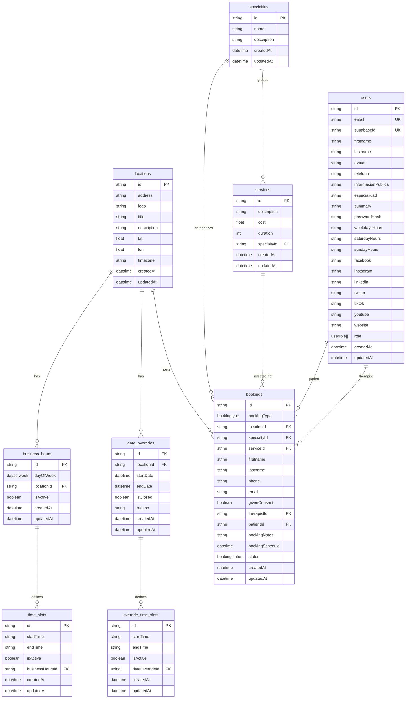

# Database Schema

This document describes the current PostgreSQL schema defined in [prisma/schema.prisma](/Users/davidguillen/Projects/david/alphabiohack/prisma/schema.prisma).

## Table Descriptions

### `users`

Stores application users for all roles: patients, therapists, and admins.

Key responsibilities:

- authentication identity mapping via `supabaseId` or local auth via `passwordHash`
- profile data such as `firstname`, `lastname`, `avatar`, `telefono`, and social links
- therapist-facing public information such as `especialidad`, `summary`, and display hours
- relationship anchor for patient bookings and therapist bookings

### `locations`

Stores practice or clinic locations where appointments can occur.

Key responsibilities:

- address and branding data such as `title`, `address`, `logo`, and `description`
- map coordinates via `lat` and `lon`
- timezone configuration per location
- parent entity for business hours, bookings, and date overrides

### `business_hours`

Stores the weekly availability definition for a location, one row per day of week.

Key responsibilities:

- links a location to a specific `dayOfWeek`
- enables or disables a day using `isActive`
- acts as the parent for one or more `time_slots`

### `time_slots`

Stores one or more time ranges within a `business_hours` record.

Key responsibilities:

- defines opening intervals such as `09:00` to `17:00`
- supports multiple slots per day
- allows individual slots to be enabled or disabled with `isActive`

### `date_overrides`

Stores calendar exceptions for a location across a specific date range.

Key responsibilities:

- handles closures, holidays, or special schedule windows
- marks a range as fully closed with `isClosed`
- provides optional human-readable context through `reason`
- acts as the parent for override-specific time slots when a day is not fully closed

### `override_time_slots`

Stores custom time windows attached to a `date_overrides` record.

Key responsibilities:

- defines special opening times for override days
- allows custom availability instead of normal weekly business hours

### `specialties`

Stores the medical or therapeutic specialty catalog.

Key responsibilities:

- groups services under a specialty
- can be referenced directly by bookings

### `services`

Stores bookable services offered under a specialty.

Key responsibilities:

- defines `description`, `cost`, and `duration`
- belongs to one specialty
- can be attached to bookings

### `bookings`

Stores patient appointments.

Key responsibilities:

- captures patient contact details and consent
- links an appointment to a `location`, optional `specialty`, optional `service`, optional `therapist`, and optional patient `user`
- stores schedule, notes, booking type, and lifecycle status

## ER Diagram

## Notes

- Prisma model names map to snake_case database tables through `@@map(...)`.
- `users.passwordHash` is used for local auth mode and can be null for non-local-auth users.
- `bookings.patientId` and `bookings.therapistId` both reference `users.id`, but represent different roles in the same table.
